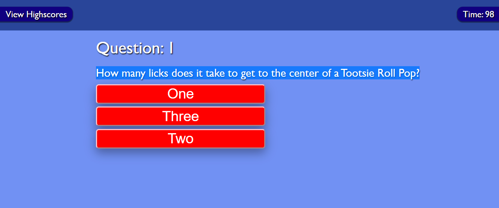

# Coding assignment to create a multiple-choice quiz with a timer

At some point in your journey to become a full-stack web developer, you’ll likely be asked to complete a coding assessment&mdash;perhaps as part of an interview process. A typical coding assessment includes both multiple-choice questions and interactive coding challenges. 

To help familiarize you with these tests and allow you to use the skills covered in this module, this Challenge invites you to build a timed coding quiz with multiple-choice questions. This app will run in the browser and will feature dynamically updated HTML and CSS powered by JavaScript code that you write. It will have a clean, polished, and responsive user interface. 

This week’s coursework will equip you with all the skills you need to succeed in this assignment.

## Challenges in this course

[Here is a link to the final release of my portfolio for this assignment](https://lonheligas.github.io/quiz-for-geeks-and-other-people/)

[This is the repository for this challenge](https://github.com/lonHeligas/quiz-for-geeks-and-other-people)

Screenshot of the final portfolio:


## Challenges I encountered

I had a lot to juggle when it came to this project. The variables alone were intimidating, and I'm sure I could figure out a better way to store all of those variables for eding the DOM if I had more time. Several points stuck as annoying glitches, but I think I was able to remove them.


## User Story

```
AS A coding boot camp student
I WANT to take a timed quiz on JavaScript fundamentals that stores high scores
SO THAT I can gauge my progress compared to my peers
```

## Acceptance Criteria

```
GIVEN I am taking a code quiz
WHEN I click the start button
THEN a timer starts and I am presented with a question
WHEN I answer a question
THEN I am presented with another question
WHEN I answer a question incorrectly
THEN time is subtracted from the clock
WHEN all questions are answered or the timer reaches 0
THEN the game is over
WHEN the game is over
THEN I can save my initials and my score

## Review

You are required to submit the following for review:

* The URL of the deployed application.

* The URL of the GitHub repository, with a unique name and a README that describes the project.

---
© 2022 Trilogy Education Services, LLC, a 2U, Inc. brand. Confidential and Proprietary. All Rights Reserved.


